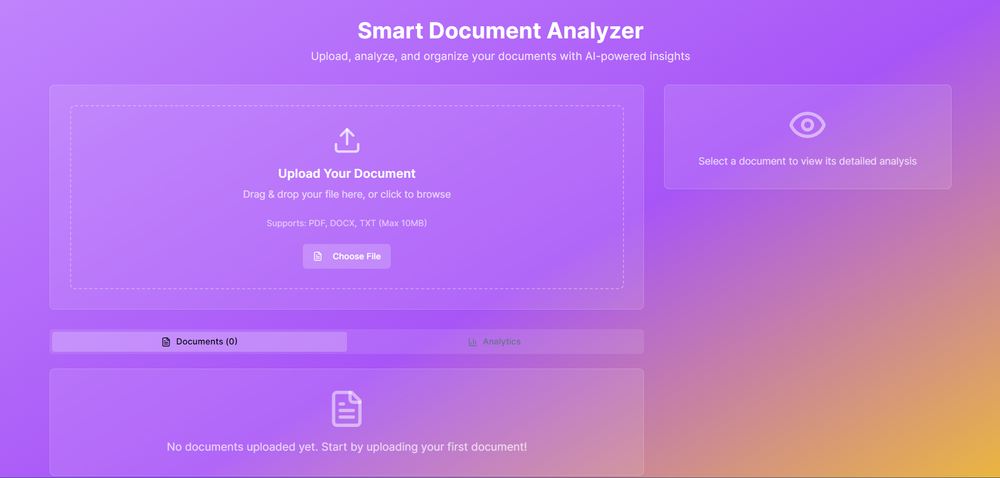

# Smart Document Analyzer

## Overview

The Smart Document Analyzer is an innovative web application designed to effortlessly analyze various document types, including text and PDF and Doc files. Leveraging the power of artificial intelligence, this tool provides insightful analytics and extracts key information from your documents, making data comprehension and organization simpler than ever. This project was developed as a task for [iCreativez](https://www.icreativez.com/).

## Features

- **Document Analysis**: Upload and analyze `.txt`, `.pdf`, `.zip` and `.docx` files.
- **AI-Powered Insights**: Utilizes advanced AI models to extract meaningful information and provide insights from your documents.
- **User-Friendly Interface**: A clean and intuitive design ensures a seamless user experience.
- **Download the AI Summary**: Download the AI summary and insights as a PDF to share easily.

## Technologies Used

This project is built using a modern web development stack to ensure high performance, scalability, and a rich user experience.

### Frontend

 **React** &nbsp;&nbsp; 
 **Vite** &nbsp;&nbsp;
 **Tailwind CSS** &nbsp;&nbsp;
 **Shadcn UI**

### Backend/API

 **Groq**

## Live Project

You can access the live version of the project here: [Smart Document Analyzer](https://smart-document-analyzer.vercel.app/)

## Code Repository

The complete source code for this project is available on GitHub: [Smart Document Analyzer GitHub](https://github.com/Raufjatoi/Smart-Document-Analyzer)

## Task given by iCreativez

This project was completed as a task for [iCreativez](https://www.icreativez.com/).

## Credits

- **Developed by**: [Abdul Rauf Jatoi](https://raufjatoi.vercel.app/)
- **Team Lead**: Muhammad Kamran